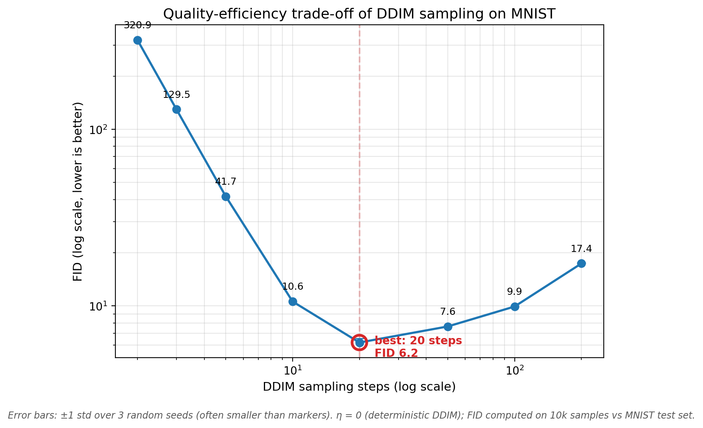

# DDPM from Scratch + DDIM Sampling Study

From-scratch PyTorch implementation of Denoising Diffusion Probabilistic Models
(Ho et al. 2020), plus a systematic study of the quality-efficiency trade-off of
DDIM accelerated sampling (Song et al. 2021) on MNIST.

<!-- TODO: 首圖兩張並排：assets/fid_curve_polished.png 和 assets/denoising_trajectory.png -->


## Highlights

- **From-scratch DDPM**: U-Net (2.5M params, time embedding + attention),
  linear noise schedule, EMA, mixed-precision training, resume-safe
  checkpointing — trained on Colab.
- **Finding — a U-shaped quality curve**: on MNIST, DDIM with **20 steps
  achieves the best FID (6.19)**, outperforming 200 steps (17.36). More
  sampling steps are not always better.
- **Phase-transition-like collapse**: quality degrades gently down to 3 steps
  (FID 129.5) then collapses catastrophically at 2 steps (FID 320.9).
- **Robustness**: the 20-vs-200 ordering holds across 3 random seeds
  (20 steps: 6.39 ± 0.19; 200 steps: 17.48 ± 0.12).

## Results

| DDIM steps | 2 | 3 | 5 | 10 | **20** | 50 | 100 | 200 |
|---|---|---|---|---|---|---|---|---|
| FID ↓ | 320.9 | 129.5 | 41.7 | 10.6 | **6.2** | 7.6 | 9.9 | 17.4 |

<!-- TODO: 放步數對比圖 assets/ddim_steps_comparison.png 與低步數版 -->

### How this finding emerged

<!-- TODO: 寫成小故事（口試主敘事）：
1. 去噪軌跡視覺化 → 注意到多數步數花在高噪聲區間、結構在最後才浮現
2. 定性步數對比 → 意外發現 1000 步的背景反而有殘噪斑點
3. 提出假設 → 低噪聲區間的模型誤差以高頻殘噪累積
4. FID 量化 → 證實 U 型；3 seeds 確認穩健 -->

## Implementation notes

<!-- TODO: 架構細節、訓練設定（30k steps, batch 128, AdamW 2e-4, fp16, EMA 0.999）、
Colab 工作流（checkpoint 到 Drive、resume 機制、本機 SSD 存 FID 圖片）-->

## Derivation notes

See [notes/derivation.md](notes/derivation.md) — hand-worked derivations of:
forward-process closed form, ELBO decomposition, the simplified
epsilon-prediction loss, and the DDIM non-Markovian formulation.

## Discussion & limitations

<!-- TODO:
- U 型右臂的假設性解釋（低噪聲 timestep 的密集查詢累積高頻誤差；
  x0 clamp 在不同步數下的不對稱影響）— 標明為假設，附驗證構想
- FID 侷限：Inception 為 ImageNet 彩圖訓練，MNIST 灰階小圖上絕對值意義有限，
  相對比較仍可信
- Future work: CIFAR-10 驗證 U 型是否重現、eta 掃描、1000 步補點 -->

## Reproduce

```bash
pip install -r requirements.txt
```

```python
# 1. Train (Colab: mount Drive first; ~25 min on A100, ~1.5 hr on T4)
from ddpm_mnist import train
train()

# 2. FID sweep (~50 min on A100)
from fid_eval import prepare_real_images, run_fid_experiment, run_seed_check
prepare_real_images()
results = run_fid_experiment()
run_seed_check(seed=42)

# 3. Plot
from plot_utils import plot_fid_curve
plot_fid_curve()
```

<!-- TODO: 補實測的 Colab 運算單元消耗，給讀者參考 -->
