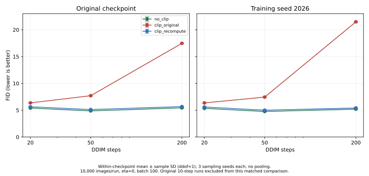
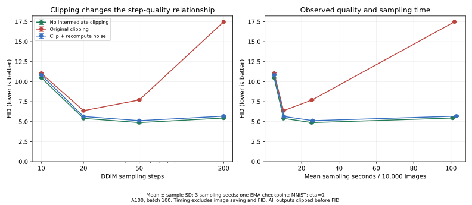
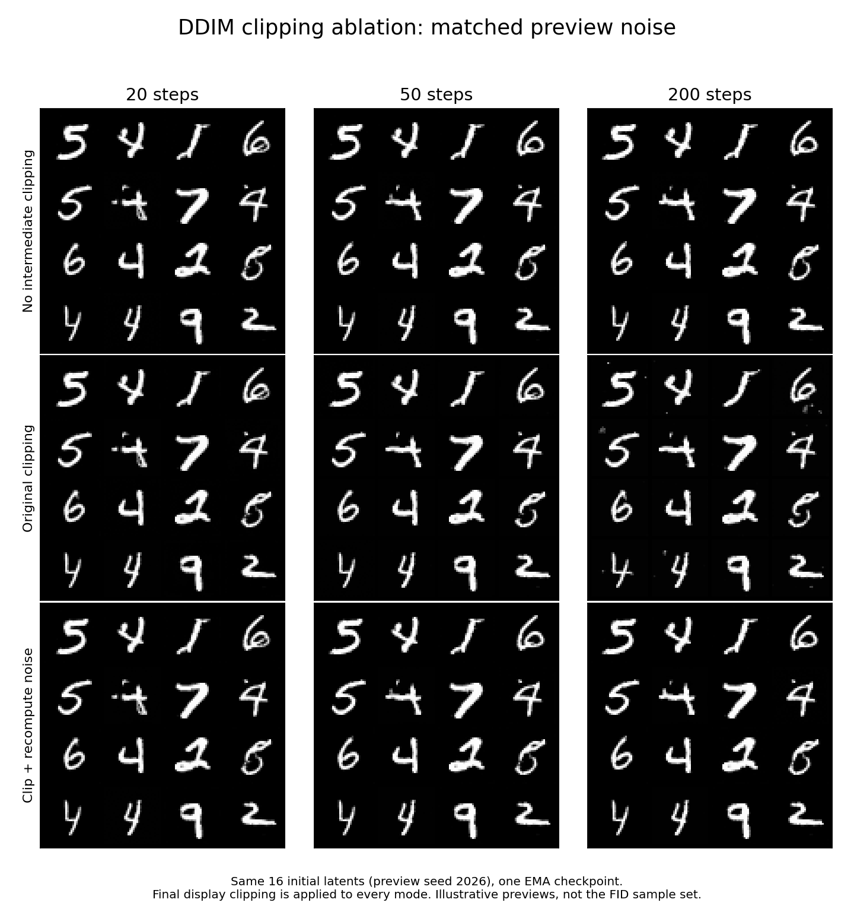

# DDPM from Scratch + DDIM Clipping Ablation

From-scratch PyTorch DDPM on MNIST, with an empirical study of how clipping
and noise recomputation affect DDIM's sampling-step/quality relationship.



## Notebook entry points

- [Review notebook](ddpm_experiments_review.ipynb): organized sections; default
  Run All rebuilds archived statistics only. Training and FID are opt-in.
- [Original execution record](ddpm_experiments.ipynb): uploaded notebook and saved
  outputs preserved unchanged.
- [Notebook audit](notes/notebook_review.md): edits, observed issues, and validation limits.

The review notebook has not been executed in Colab during this update.
It includes the three-mode experiment code derived from the uploaded notebook;
the archived JSON files remain the reference for published measurements.

## Main findings

The clipping comparison has now been observed in **two checkpoints**, each
evaluated with sampling seeds **0, 42, 123** on their common 20/50/200-step grid.

- Original clipping has its lowest measured FID at 20 steps in both models.
- No intermediate clipping and clipping with noise recomputation have their
  lowest measured FID at 50 steps in both models.
- At 200 steps, original clipping versus recomputed noise gives mean FID
  **17.471 vs 5.680** for the original model and **21.481 vs 5.419** for the
  new training-seed-2026 model.
- A smaller increase from 50 to 200 steps remains for both alternative modes
  in every sampling seed of both models.

This supports sensitivity to clipping treatment beyond the first checkpoint,
but does not establish broad training robustness or a high-frequency error
mechanism. All standard deviations below describe sampling variation within
one model; six sampling runs are not six independent training runs.

## New checkpoint: training seed 2026

Mean ± sample SD (ddof=1), n=3 sampling seeds, 10,000 images per run.
The original model is retained separately below; no scores are pooled.

| Steps | No intermediate clipping | Original clipping | Clip + recompute |
|---|---|---|---|
| 20 | 5.350 ± 0.049 | 6.362 ± 0.051 | 5.600 ± 0.069 |
| 50 | 4.764 ± 0.087 | 7.449 ± 0.099 | 5.003 ± 0.105 |
| 200 | 5.208 ± 0.096 | 21.481 ± 0.088 | 5.419 ± 0.114 |


The added batch contains 27 measurements (3 modes × 3 step counts × 3 seeds).
Together with the original 36, the archive contains 63 measurements.
The matched two-model comparison uses 54 measurements at common step counts;
the original nine 10-step measurements are retained but excluded from that figure.

### New-model provenance

- Training seed: 2026; [training configuration](results/clipping_ablation/train_seed_2026/training_config.json).
- Checkpoint SHA-256: `41399fca5807a9531e89102a15dcc45341d30dfb9684d0883eade53cb41cc16c`,
  different from the original checkpoint.
- Training configuration records a 30,000-step target, batch 128, learning rate
  2e-4, EMA 0.999, and source commit
  `38666c71b849ba3a70a1311304e79bc69bc1480c`.
  The supplied [checkpoint metadata](results/clipping_ablation/train_seed_2026/checkpoint_metadata.json)
  records 30,000 completed steps and EMA availability, with the same SHA-256
  as the evaluation results. This is a user-exported checkpoint inspection
  record; it does not independently verify an uninterrupted training trajectory.
- All recorded evaluation settings match the original runs except checkpoint
  hash and omission of the 10-step setting. Sampling seeds are matched.
- [Raw seed 0](results/clipping_ablation/train_seed_2026/seed_0.json),
  [seed 42](results/clipping_ablation/train_seed_2026/seed_42.json),
  [seed 123](results/clipping_ablation/train_seed_2026/seed_123.json).
- [Separate-checkpoint summary CSV](results/clipping_ablation/checkpoint_summary.csv)
  and [tables](results/clipping_ablation/checkpoint_tables.md).

These uploaded Colab results were archived unchanged; statistics and figures
were rebuilt from them. No training or FID evaluation was rerun for this update.
New-model preview images have not been supplied; the visual examples later
in this README belong only to the original checkpoint.

Rebuild this comparison without a GPU:

```bash
pip install matplotlib
python scripts/compare_checkpoints.py
```

The script checks seed identities, run completeness, recorded configuration
agreement, distinct checkpoint hashes, and relevant training settings.
It regenerates per-model tables, CSV, and SVG/PNG comparison figures.

## Original checkpoint: clipping ablation




Mean ± **sample standard deviation (ddof=1)** over three sampling seeds.
Every cell has n=3; each run generates 10,000 images. Lower FID is better.

| Steps | No intermediate clipping | Original clipping | Clip + recompute noise |
|---|---|---|---|
| 10 | 10.486 ± 0.080 | 11.039 ± 0.070 | 10.832 ± 0.063 |
| 20 | 5.405 ± 0.058 | 6.369 ± 0.047 | 5.639 ± 0.066 |
| 50 | 4.878 ± 0.061 | 7.707 ± 0.073 | 5.121 ± 0.052 |
| 200 | 5.447 ± 0.082 | 17.471 ± 0.099 | 5.680 ± 0.069 |


The compared update rules are:

| Mode | Intermediate clean-image estimate | Direction noise |
|---|---|---|
| no_clip | Unclipped | Original predicted noise |
| clip_original | Clipped to [-1, 1] | Original predicted noise |
| clip_recompute | Clipped to [-1, 1] | Recomputed to agree with clipped estimate |

**All modes clip the final image to [-1, 1] before conversion to PNG and FID.**
“No clipping” therefore refers only to intermediate sampling updates.
The no_clip out-of-range fraction is recorded before final clipping; it does
not measure clipping magnitude or independently establish image quality.

### Protocol and provenance

- One 30,000-step EMA checkpoint, as reported by the Colab checkpoint inspection.
- SHA-256: `c4145894a7dfd44a695396070fccd142c53fff3c06c46e4d04a66a4177b3adc6`.
- MNIST, padded to 32×32; T=1000; linear beta from 0.0001 to 0.02; eta=0.
- Batch size 100, NVIDIA A100-SXM4-40GB, recorded PyTorch 2.11.0+cu128.
- Matched initial-noise sequences across modes and step counts within each seed.
- Colab used clean-fid in clean mode against 10,000 padded MNIST test images.
  The exact clean-fid version was not recorded.
- These are user-executed Colab measurements archived without changing scores;
  this update recomputes statistics and plots, not generation or FID.
- Raw files: [seed 0](results/clipping_ablation/seed_0.json),
  [seed 42](results/clipping_ablation/seed_42.json),
  [seed 123](results/clipping_ablation/seed_123.json).
- [Summary CSV](results/clipping_ablation/summary.csv) includes mean sampling times.

Mean sampling time for 10,000 images is approximately 10–11 seconds at 20 steps,
25–26 seconds at 50 steps, and 101–103 seconds at 200 steps.
Timing covers synchronized sampler calls after warm-up; it excludes initial-noise
creation, PNG saving, preview generation, and FID evaluation. These are observed
times from the runs, not a separate randomized latency benchmark.

The weights are not included in this repository. The supplied preview PNGs are archived in [assets/clipping_previews](assets/clipping_previews).
The ablation was run using the Colab cell supplied for this study; the existing
`ddim.py` still implements the original clipped mode. The legacy FID runner
does **not** reproduce all three modes. The script below reproduces the
summary and figure from the archived measurements only.

## Rebuild the published statistics and figure

From the repository root:

```bash
pip install matplotlib
python scripts/summarize_ablation.py
```

No GPU, model weights, or MNIST download is needed. The script validates seed
identities, matching recorded configurations, and all 36 result entries before
writing the summary CSV, Markdown table, and SVG/PNG figures. It uses Python's
sample standard deviation and plots means with corresponding error bars.

## Fixed-noise preview comparison



Rows: no intermediate clipping, original clipping, and clipping with recomputed
noise. Columns: 20, 50, and 200 steps. Each panel shows the same 16 initial
latents (preview seed 2026 in the experiment cell). All modes receive the same
final display clipping. The supplied archive's results.json exactly matches
the archived sampling-seed-0 experiment; preview seed and evaluation seed are
different.

### Visual observations and limits

- Corresponding positions largely preserve recognizable digit structures across
  modes and step counts in these previews.
- Original clipping at 200 steps shows visible isolated background marks,
  including near the top-right sample and beside the second-row left sample.
  Corresponding regions look cleaner in the two alternative 200-step panels.
- This is consistent with an observable effect of clipping treatment, but does
  not establish that these marks explain the full FID gap or prove a
  high-frequency accumulation mechanism.
- The alternative 50- and 200-step panels are visually similar at this scale.
  These 16 examples do not reliably resolve their smaller FID differences.

The previews are illustrative, not the 10,000-image FID sets. Their fixed
seed is shared across runs, so repeated copies from different evaluation-seed
folders are not independent visual evidence. No class labels or image-wide
quality ratings are inferred from this small grid.

Rebuild the comparison from the nine original PNGs with
`python scripts/build_preview_figure.py` (requires matplotlib). The script only
arranges existing images using nearest-neighbor display; it does not regenerate
or retouch digits.

## Implementation and derivations

The existing training configuration uses 30,000 steps, batch size 128, AdamW
at 2e-4, EMA decay 0.999, and CUDA mixed precision. Checkpoints restore model,
EMA, optimizer, and step, but not all RNG or GradScaler state for exact continuation.

[Derivation notes](notes/derivation.md) cover forward marginals, ELBO telescoping,
Gaussian KL, simplified noise MSE, DDIM's non-Markovian construction, and code
mappings. In particular, eta=1 is not identical to this repository's DDPM
sampler, which uses beta rather than posterior beta-tilde variance.

## Historical exploration

The earlier original-clipping sweep reported:

| Steps | 2 | 3 | 5 | 10 | 20 | 50 | 100 | 200 |
|---|---|---|---|---|---|---|---|---|
| Single-seed FID | 320.9 | 129.5 | 41.7 | 10.6 | 6.2 | 7.6 | 9.9 | 17.4 |

These historical values are **not pooled with the new ablation**. The old runner
uses batch size 500 and a different RNG setup; an identical numeric seed need
not give identical initial samples across the two implementations.
The previous “20 steps best” claim is now scoped to original clipping and tested
settings. Low-step degradation alone does not establish a phase transition.
The old plot and plotting utility remain historical artifacts; use
`scripts/summarize_ablation.py` for the current figure.

## Limitations and next steps

**Completed:** original checkpoint: 36 measurements; new training-seed-2026 checkpoint: 27 measurements. Raw scores, new training configuration, per-model statistics, and a matched comparison figure are archived.

**Completed visual follow-up:** nine preview grids have been archived and combined
above for the original checkpoint only. One additional training run has now
been evaluated; further training replication remains useful.

**Further experiments:**

1. Checkpoint-linked completed-step metadata is now archived for the new model.
   Add further independently seeded training runs in separate directories before
   making broad claims about training variability.
2. Add domain-relevant quality/diversity metrics and inspect final clipping
   magnitudes. Inception features and finite-sample FID have limitations.
3. Densify step counts around the observed minimum using a validation split
   for selection, then evaluate on held-out data. The current minima were
   selected using test-set FID and are exploratory.
4. Extend datasets, noise schedules, and eta; add mechanistic diagnostics before
   attributing the remaining increase to accumulated high-frequency errors.

The three sampling seeds per checkpoint do not quantify training variability,
metric bias, or uncertainty from resampling the real-image reference set.
Two checkpoints provide limited replication, not a reliable estimate of the
full distribution across training runs.

## References

- [Ho et al., DDPM](https://arxiv.org/abs/2006.11239)
- [Song et al., DDIM](https://arxiv.org/abs/2010.02502)
- [Chong & Forsyth, finite-sample FID bias](https://arxiv.org/abs/1911.07023)
