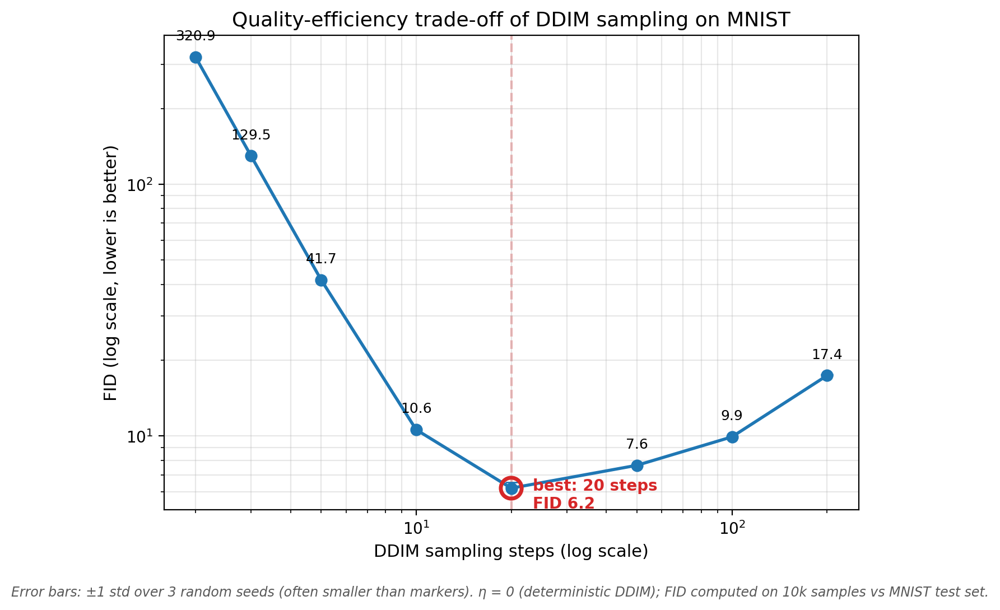

# DDPM from Scratch + DDIM Sampling Study

From-scratch PyTorch implementation of Denoising Diffusion Probabilistic Models
(Ho et al. 2020), plus an exploratory study of the quality-efficiency trade-off of
DDIM accelerated sampling (Song et al. 2021) on MNIST.




**Figure caveat:** this is the existing figure, not a newly validated result.
The main curve uses a single sampling seed; the plotting code places available
multi-seed error bars at their means. Its blanket “3 random seeds” caption
should not be read as three independent training runs or verification of every
point. Regenerating a statistically consistent figure is future work.

## Highlights

- **From-scratch DDPM**: U-Net (2.5M params, time embedding + attention),
  linear noise schedule, EMA, mixed-precision training, resume-safe
  checkpointing — trained on Colab.
- **Observed U-shaped curve**: for the evaluated checkpoint and tested settings,
  20 DDIM steps yielded the lowest reported single-seed FID (6.19), compared
  with 17.36 at 200 steps. The cause and generality remain unverified.
- **Very low step counts**: reported FID rises to 129.5 at 3 steps and 320.9
  at 2 steps; this alone does not establish a phase transition.
- **Sampling-seed check**: the previously reported 20-vs-200 ordering holds
  across 3 sampling seeds for the same checkpoint (20: 6.39 ± 0.19;
  200: 17.48 ± 0.12). These are not independent training runs.

## Results

| DDIM steps | 2 | 3 | 5 | 10 | **20** | 50 | 100 | 200 |
|---|---|---|---|---|---|---|---|---|
| FID ↓ | 320.9 | 129.5 | 41.7 | 10.6 | **6.2** | 7.6 | 9.9 | 17.4 |

<!-- TODO: 放步數對比圖 assets/ddim_steps_comparison.png 與低步數版 -->

## Implementation notes

The current configuration specifies 30,000 training steps, batch size 128,
AdamW with learning rate 2e-4, a linear noise schedule, and EMA decay 0.999.
CUDA training uses mixed precision. Checkpoints restore model, EMA, optimizer,
and step, but do not preserve all RNG or GradScaler state for exact continuation.

## Derivation notes

See [notes/derivation.md](notes/derivation.md) — derivations and implementation mappings for:
forward-process closed form, ELBO decomposition, the simplified
epsilon-prediction loss, and the DDIM non-Markovian formulation.

## Discussion & limitations

The results are limited to MNIST, one evaluated checkpoint, the current
clipped DDIM implementation, a linear schedule, and eta=0. They do not establish
that 20 steps is universally optimal. High-frequency error accumulation and
step-dependent clipping effects are hypotheses, not demonstrated explanations.

FID uses ImageNet-trained features, whose suitability for small grayscale
digits needs cross-checking. Equal sample counts do not eliminate finite-sample
FID bias. Sampling steps are a computation proxy, not measured wall-clock
speedup. Existing numbers above are retained as previously reported; no
training or FID evaluation was rerun for this documentation update.

### Future validation (not yet completed)

1. Compare no clipping, current clipping, and clipping with a recomputed
   consistent noise estimate, using the same checkpoint and initial noise.
2. Train independent seeds and distinguish training variability from sampling
   variability. Archive checkpoint identifiers, configurations, and raw scores.
3. Add nearby step counts (15, 25, 30) and full-step baselines; separate
   validation-based selection from final test reporting.
4. Add paired sample grids, domain-relevant quality/diversity checks, and
   generation-time measurements on fixed hardware, excluding PNG saving and
   FID computation. Replot means and error bars consistently with per-point n.
5. Extend eta, noise schedules, and datasets to test generality.

The mathematical notes explain existing methods; they do not replace these
experiments. See [the detailed derivation and future-work notes](notes/derivation.md).

For evaluation bias, see [Chong & Forsyth, Effectively Unbiased FID and
Inception Score](https://arxiv.org/abs/1911.07023).

## Reproduce

```bash
pip install -r requirements.txt
```

```python
# 1. Train (Colab: mount Drive first; ~25 min on A100, ~1.5 hr on T4)
from ddpm_mnist import train
train()

# 2. FID sweep (~50 min on A100)
from fid_eval import prepare_real_images, run_fid_experiment, run_seed_check
prepare_real_images()
results = run_fid_experiment()
run_seed_check(seed=42)

# 3. Plot
from plot_utils import plot_fid_curve
plot_fid_curve()
```

<!-- TODO: 補實測的 Colab 運算單元消耗，給讀者參考 -->
